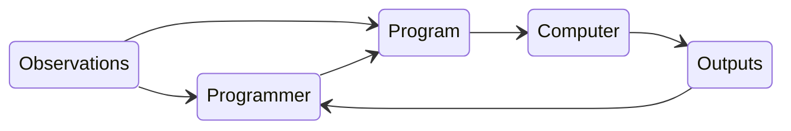
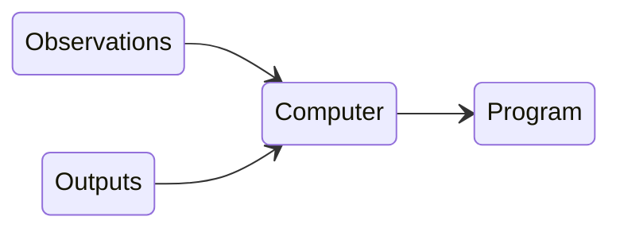

# Overview of Statistical Learning

---
layout: quote
---

## *Programming computers to learn from experience should eventually eliminate the need for much of this detailed programming effort.*
 
 

 Arthur L. Samuel (1959)*  AI & ML pioneer

 
 
 
 
 
 
 

##### * Arthur L. Samuel, “Some studies in machine learning using the game of checkers", *IBM Journal of research and development* 3.3 (1959), pp. 210-229

---

## The Traditional Programming Paradigm
 
<v-click>

</v-click>
 
 
<v-click>

## Machine Learning Paradigm
 

##### *Machine learning is the field of study that gives computers the ability to learn without being explicitly programmed*
</v-click>

---
layout: quote
---

## *A computer program is said to **learn** from experience $E$  with respect to some class of tasks $T$ and performance measure $P$, if its performance at tasks in $T$, as measured by $P$,  improves with experience $E$.*
 
 

 Tom Mitchell (1997)*  Machine Learning Professor  at Carnegie Mellon University 

 
 
 
 
 
 
 
 
 

##### * Tom M Mitchell et al., “Machine learning”, *Burr Ridge, IL: McGraw Hill 45.37* (1997), pp. 870–877

---
layout: quote
---

## *A computer program is said to **learn** from experience $E$  with respect to some class of tasks $T$ and performance measure $P$, if its performance at tasks in $T$, as measured by $P$,  improves with experience $E$.*
 

### Consider the problem of recognizing handwritten digits

<figure>
  
  <figcaption style="color:#b3b3b3ff; font-size: 11px;">Examples of digits from the MNIST dataset
  </figcaption>
</figure>

Here:
* Task $T$: classifying handwritten digits from images
* Performance measure $P$: percentage of digits classified correctly
* Training experience $E$: dataset of digits given classifications, e.g., MNIST

---

# Applications of Machine Learning

* Email spam detection
* Face detection and matching
  * Unlocking your phone
* Web search
* Post office
  * Sorting letters by zip codes
* Credit card fraud
* Stock predictions
* Smart assistants
  * Apple Siri, Yandex Alisa

* Product recommendations
  * Netflix, Amazon
* Self-driving cars
  * Uber, Tesla
* Language translation
  * Google translate, DeepL
* Sentiment analysis
* Medical diagnoses
* ...

---

# Applications of Machine Learning

* What is the desired outcome?
* What could the dataset look like?
* Is this a supervised or unsupervised problem, and what algorithms would you use?
* How would you measure success?
* What are potential challenges or pitfalls?

---

# Categories of Machine Learning

<figure>
  
  <figcaption style="color:#b3b3b3ff; font-size: 11px;">Image source:  <a href="https://github.com/rasbt/python-machine-learning-book-2nd-edition">S.Raschka, V. Mirjalili: Python Machine Learning, 2nd Ed.</a>
  </figcaption>
</figure>

---

# Supervised Learning: Classification

<figure>
  
  <figcaption style="color:#b3b3b3ff; font-size: 11px;">Image source:  <a href="https://github.com/rasbt/python-machine-learning-book-2nd-edition">S.Raschka, V. Mirjalili: Python Machine Learning, 2nd Ed.</a>
  </figcaption>
</figure>

---

# Supervised Learning: Regression

<figure>
  
  <figcaption style="color:#b3b3b3ff; font-size: 11px;">Image source:  <a href="https://github.com/rasbt/python-machine-learning-book-2nd-edition">S.Raschka, V. Mirjalili: Python Machine Learning, 2nd Ed.</a>
  </figcaption>
</figure>

---

# Unsupervised Learning: Clustering

<figure>
  
  <figcaption style="color:#b3b3b3ff; font-size: 11px;">Image source:  <a href="https://github.com/rasbt/python-machine-learning-book-2nd-edition">S.Raschka, V. Mirjalili: Python Machine Learning, 2nd Ed.</a>
  </figcaption>
</figure>

---

# Unsupervised Learning: Dimensionality Reduction

 
 
<figure>
  
</figure>

---

# Reinforcement Learning

 
<figure>
  
  <figcaption style="color:#b3b3b3ff; font-size: 11px;">Image source:  <a href="https://github.com/rasbt/python-machine-learning-book-2nd-edition">S.Raschka, V. Mirjalili: Python Machine Learning, 2nd Ed.</a>
  </figcaption>
</figure>
 
<v-click>

Applications:
* Self-driving cars
* AlphaGo / AlphaZero
* Auto-GPT
</v-click>

---

# Supervised Learning Problem

* Let $X$ be a **data matrix** with $N$ observations and $p$ predictors: 
$X = [X_1, X_2, ..., X_p] \in \R^{N \times p}$

* Let $Y$ be the **response** vector with $N$ corresponding labels: 
$Y \in R^N$

* We want to find a **fixed**, but **unknown** function $f$: 
$Y = f(X) + \varepsilon$
  * Here we have $\varepsilon$, which is an **independent**, **zero-mean** and **homoscedastic** random variable: $\varepsilon \perp\!\!\!\!\perp X_i, \mathbb{E}\varepsilon = 0, \mathbb{V}\varepsilon < \infty$

* The goal in statistical learning is then to estimate $f$, which can then be used to predict $Y$: 
$\hat{f}(X) = \hat{Y}$
  * $\hat{f}$ is also known as the **hypothesis** function

---

# Supervised Learning Workflow

 
<figure>
  
  <figcaption style="color:#b3b3b3ff; font-size: 11px;">Image source:  <a href="https://github.com/rasbt/python-machine-learning-book-2nd-edition">S.Raschka, V. Mirjalili: Python Machine Learning, 2nd Ed.</a>
  </figcaption>
</figure>

---

# Supervised Learning Workflow

<figure>
  
  <figcaption style="color:#b3b3b3ff; font-size: 11px;">Image source: <a href="https://github.com/rasbt/python-machine-learning-book-2nd-edition">S.Raschka, V. Mirjalili: Python Machine Learning, 2nd Ed.</a>
  </figcaption>
</figure>